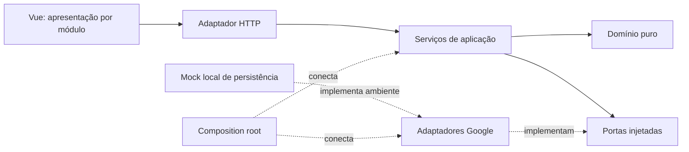

# Arquitetura

## Unidade de implantação

O backend é um **monólito modular**: quatro módulos, um único processo lógico de aplicação, uma planilha e um bundle Apps Script. O frontend é o adaptador de apresentação, publicado como arquivos estáticos. Não há microserviços, filas ou dependência de um servidor adicional em produção.

## Contextos e linguagem de domínio

| Módulo | Responsabilidade | Conceitos |
| --- | --- | --- |
| Identity | Cadastro, sessão, autorização e perfil | Jogador, administrador, conta bloqueada/ativa, pontos |
| Catalog | Campos e faixas configuráveis | Campo, faixa de força, categoria ativa |
| Records | Submissão, revisão, publicação e ranking | Record, versão, proposta, categoria, melhor score |
| Community | Votos e reavaliação | Voto ponderado, quórum, decisão, apelação |

A interface administrativa orquestra esses módulos; não possui regras próprias de autorização. Toda autorização é repetida no backend.

## Camadas e dependências



- **Domínio:** `RecordDraft`, objeto imutável que valida dados de uma partida; `RecordPolicy`, publicação e desempate; `VotingPolicy`, decisão do quórum; `effectivePoints`, cálculo determinístico de pontos com data explícita. Não dependem de Vue, HTTP, arquivos ou Google.
- **Aplicação:** fábricas `createIdentityModule`, `createCatalogModule`, `createRecordsModule` e `createCommunityModule`. Dependências são recebidas em `ports`. Orquestram autorização, leitura, domínio e persistência. Retornam objetos comuns.
- **Entrada:** `adapters/http.js` interpreta o protocolo legado, rejeita ações não registradas e serializa as respostas. O lock de escrita engloba a execução de um caso de uso.
- **Saída:** `infrastructure/google-apps-script.js` encapsula acesso à planilha, hash, sessões e validação de tokens Google. Snapshots de abas usam `CacheService` compactado por cinco minutos; toda escrita invalida sua aba. Nenhum objeto `SpreadsheetApp` é entregue aos módulos.
- **Composição:** `composition.js` injeta implementações e mapeia ações para o módulo responsável. `Code.gs` é concatenação determinística das fontes, sem dependência de npm no runtime Google.

## Portas de saída

As portas são contratos estruturais de JavaScript, recebidos explicitamente pelo construtor de cada módulo:

| Porta | Contrato |
| --- | --- |
| `ids.next()` | Identificador novo |
| `googleIdentity.verify(token)` | Claims verificáveis do login Google |
| `_rows(name)` | Snapshot `{ header, rows }` de uma coleção |
| `_append(name, object, header)` | Insere entidade persistida |
| `_table(name)` | Repositório tabular: `read`, `remove`, `range().write/writeMany` |
| `_authUser`, `_isAdmin` | Identidade autenticada/autorização |
| `_findUserById`, `_findUserByEmail`, `_newSession` | Serviços de identidade |
| `_bandForPower`, `_recalcBest`, `_makeProposal`, `_addPoints`, `_tally` | Serviços compartilhados da migração |

O adaptador tabular traduz esses métodos para Sheets; o contrato não requer a API do Google. Os testes completos executam o mesmo bundle de produção sobre o mock local. Testes de domínio não instanciam adaptadores.

## Decisões e limites atuais

DDD foi aplicado à linguagem dos contextos, aos limites dos módulos e às políticas/objeto de valor. A migração preserva o esquema original e o contrato HTTP, evitando uma migração destrutiva dos dados existentes.

O contrato de persistência ainda é tabular e alguns serviços compartilhados contêm regras legadas. Há operações coordenadas entre módulos, como pontuar o jogador ao aprovar um record, e acesso às coleções relacionadas. Portanto, esta implementação **não representa isolamento total de agregados ou de bancos por contexto**. Um próximo passo, caso necessário, é substituir as portas tabulares por repositórios orientados a entidades e mover as regras compartilhadas para os módulos responsáveis. Isso pode ser feito sem mudar as URLs ou os componentes Vue.

O lock do Apps Script serializa escritas concorrentes, mas o Sheets não fornece rollback transacional: uma falha de infraestrutura no meio de várias gravações ainda pode exigir reparo. Validações de edição são feitas antes da primeira escrita. O frontend repete somente leituras em falhas transitórias; mutações não são repetidas automaticamente, evitando duplicação após respostas perdidas.

## Regras relevantes

- Menor score vence; empate usa maior Pang. Campo/faixa/método/vento definem categorias independentes.
- Novo record e edição de record não publicado voltam a `pending`.
- Editar um publicado cria proposta, preservando o original até a aprovação final.
- `RecordDraft` rejeita score ausente/nulo, valores não finitos, Pang negativo e prova obrigatória ausente.
- Qualquer reenvio pelo proprietário invalida os votos sobre os dados antigos.
- Quórum: três pessoas, peso de 50, maioria estritamente superior a 2:1.
- Decisão comunitária volta para o administrador; aprovação inicial sozinha não publica no ranking principal.
- As autorizações dependem da sessão consultada no servidor, nunca do estado Pinia.

## Validação

`npm test` verifica sincronização do bundle, contratos HTTP, autenticação, perfis, permissões, categorias, propostas, ranking, votação, reabertura, edição sem escrita parcial, invalidação dos votos, domínio e URLs de provas. `npm run build` valida a compilação dos componentes Vue e gera os artefatos de publicação.

### Verificação opcional no navegador

Com `npm run dev` aberto em outro terminal e Playwright instalado no ambiente de desenvolvimento:

```sh
node tests/browser.cjs
```

O script aceita `PLAYWRIGHT_MODULE` (caminho de uma instalação existente), `CHROMIUM_PATH` (executável opcional) e `PWR_BROWSER_URL` (somente localhost). Usa a conta admin das fixtures e valida desktop/celular, filtros, estado vazio, retorno após login, rotas protegidas, perfil, cadastro, erro da API e recuperação. Salva capturas em `/tmp/pwr-desktop.png`, `/tmp/pwr-mobile.png` e `/tmp/pwr-register.png`. Não execute testes de fixtures contra dados de produção.
